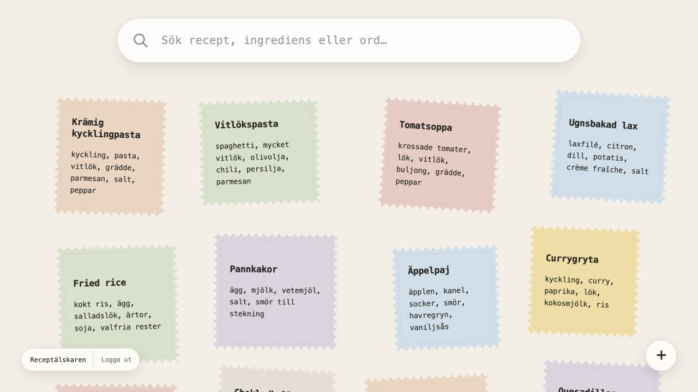

# My Recipe Notes

A simple, personal recipe app where every account has its own private collection. Save recipes as free-form notes and find them quickly with search.

A hosted instance can be configured on any domain by following the deployment guide below.



## Run locally

Requires Node.js 22.5 or later.

```bash
cp .env.example .env
npm start
```

Open [http://localhost:5171](http://localhost:5171). The database is created automatically.

Configuration belongs in `.env`, which must never be committed. Available settings are documented in [`.env.example`](.env.example).

## Deploy

Pushes to `main` can be deployed automatically to a VPS with GitHub Actions. See [DEPLOYMENT.md](DEPLOYMENT.md).

## License

[MIT](LICENSE)
